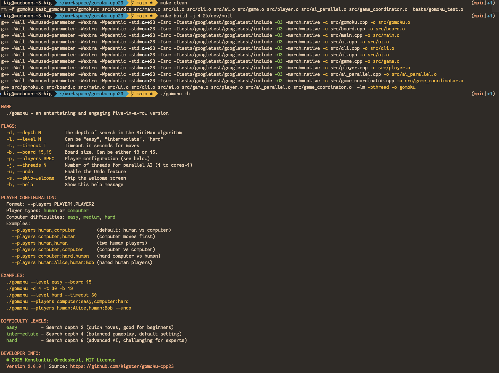

# Gomoku Game - Modern C++23 Implementation

A modern [C++23 implementation](CPP23.md) of the Gomoku (Five-in-a-Row) game featuring intelligent AI opponents using the MiniMax algorithm with Alpha-Beta pruning and advanced parallel processing.

> [!NOTE]  
> This is an enhanced C++23 version based on the original C implementation at [github.com/kigster/gomoku-ansi-c](https://github.com/kigster/gomoku-ansi-c/). This version includes significant additional features including **computer vs computer gameplay**, parallel AI processing, and modern C++23 language features.

> [!TIP]
> This project was produced in colaboration with Claude-4-MAX, but the the original **evaluation function** was written by the author. Also, when we say "playing with AI" we do not mean LLMs, we simply mean you are playing against the computer.

### Completed Game Screenshot

Here is the game where the human player prevailed, although it is exceedingly difficult to win even on Medium setting, which only looks ahead a few moves.

> [!NOTE]
> This game was popular in the former Soviet Union, but it was called "crosses and naughts" (крестики и нолики).

#### Game Example (Hard Mode, Human Wins)

> [!TIP]
> These timings were possible only after additional optimizations were introduced in [this PR](https://github.com/kigster/gomoku-ansi-c/pull/4).


## Building the Game for the Impatient

Here is how to compile and run the game:

```bash
make build -j 4
./gomoku -h
```



## Alternatively

Using CMake:

```bash
make cmake-build cmake-test
./gomoku -h | grep -i version
```


See the following screenshot for an example:


## Features

Unlike the C99 version, this one allows all combinations: human vs human, computer vs computer, etc.

### Core Gameplay

- **Interactive Console Interface**: Unicode-based board display with keyboard controls
- **Multiple Player Configurations**: Human vs AI, Human vs Human, **AI vs AI**
- **Intelligent AI**: Advanced MiniMax algorithm with Alpha-Beta pruning
- **Configurable Difficulty**: Easy, Medium, and Hard levels with different search depths
- **Timeout Support**: Optional move time limits for both human and AI players
- **Undo Functionality**: Undo the last move pair (human + AI)

### Modern C++23 Features

- **Template-based Board Class**: Compile-time size validation with concepts
- **std::expected**: Modern error handling without exceptions
- **std::span & std::string_view**: Memory-safe, efficient string handling
- **std::format**: Type-safe string formatting
- **Concepts**: `ValidBoardSize` concept for compile-time validation
- **RAII**: Automatic memory management eliminating manual malloc/free

### Advanced AI Features

- **Parallel Processing**: Multi-threaded AI search using custom thread pool
- **Computer vs Computer**: Watch AIs battle each other with different difficulties
- **Pattern Recognition**: Advanced threat-based evaluation system
- **Search Optimization**: Proximity-based move generation and intelligent ordering
- **Performance Tuning**: Configurable thread count and search parameters

### Development & Quality

- **Dual Build Systems**: Both traditional Make and CMake with full C++23 support
- **Comprehensive Testing**: 20 comprehensive tests using Google Test framework
- **Cross-platform**: Works on Linux, macOS, and other Unix-like systems
- **Modern Architecture**: Clean separation of concerns with modular design

## Game Rules

Gomoku is a strategy game where players take turns placing stones on a board. The goal is to be the first to get five stones in a row (horizontally, vertically, or diagonally).

- **Human plays first** (Crosses stones ✕) - this is an advantage
- **AI plays second** (Naughts stones ○)
- **Win condition**: First to get exactly 5 in a row wins
- **Overline rule**: Six or more stones in a row do NOT count as a win

---

## Getting Started

### Prerequisites

- **Modern C++23 Compiler** (GCC 12+, Clang 15+, or equivalent)
- **Make** build system
- **Git** (for downloading Google Test framework)
- **CMake** (optional, for CMake-based builds)
- **pthread** library for parallel processing

### Quick Setup

For first-time setup, run the automated setup script that installs dependencies and sets up Google Test:

```bash
# Clone the repository (or use the current directory if already cloned)
# git clone https://github.com/your-username/gomoku-cpp23.git
# cd gomoku-cpp23

# Run setup script (installs dependencies and Google Test)
./tests/setup
make cmake-tests
```

### Building the Game

#### Using Make (Traditional)

```bash
# Build the game
make build -j 4

# Clean build files if needed
make clean
```

#### Using CMake (Alternative)

```bash
# Build using CMake (creates build directory and runs cmake ..)
make cmake-build

# Run tests using CMake
make cmake-test

# Clean CMake build directory
make cmake-clean

# Rebuild from scratch
make cmake-rebuild
```

### Help Screen

Below is the screenshot of the help screen of the game, since it's a CLI/Terminal game.


### Running the Game

#### Human vs Computer (Default)

```bash
# Run with default settings (Human vs Computer, Medium difficulty, 19x19 board)
./gomoku

# Run with easy difficulty on a 15x15 board
./gomoku --level easy --board 15

# Run with custom search depth and timeout
./gomoku --depth 6 --timeout 30
```

#### Computer vs Computer (AI Battle Mode)

Watch two AIs battle each other with different difficulty levels:


You can start Gomoku in this mode using `--player` flag, as follows:

```bash
# AI vs AI: Hard vs Easy (skip welcome screen)
./gomoku -s --players computer:hard,computer:easy

# AI vs AI: Medium vs Medium 
./gomoku --skip-welcome --players computer:medium,computer:medium

# AI vs AI: Hard vs Hard (ultimate battle)
./gomoku -s --players computer:hard,computer:hard

# AI vs AI with custom settings
./gomoku -s --players computer:hard,computer:easy --board 15 --threads 4
```

#### Human vs Human

```bash
# Two human players
./gomoku --players human,human

# Named human players with undo enabled
./gomoku --players human:Alice,human:Bob --undo
```

#### Player Configuration Examples

```bash
# Show all available options
./gomoku --help

# Various player configurations
./gomoku --players computer,human        # Computer moves first
./gomoku --players human:Alice,computer:hard
./gomoku --players computer:easy,computer:medium
```

### Command Line Options

| Option                | Description                                          | Example                              |
| --------------------- | ---------------------------------------------------- | ------------------------------------ |
| `-p, --players SPEC`  | Player configuration (see examples above)           | `--players computer:hard,human`      |
| `-l, --level M`       | Difficulty: `easy`, `medium`, `hard`                 | `--level hard`                       |
| `-d, --depth N`       | Search depth (1-10) for AI algorithm                | `--depth 5`                          |
| `-t, --timeout T`     | Move timeout in seconds (optional)                  | `--timeout 30`                       |
| `-b, --board SIZE`    | Board size: 15 or 19 (default: 19)                  | `--board 15`                         |
| `-j, --threads N`     | Number of threads for parallel AI (1 to cores-1)    | `--threads 4`                        |
| `-u, --undo`          | Enable undo functionality                           | `--undo`                             |
| `-s, --skip-welcome`  | Skip welcome screen (useful for AI vs AI)           | `--skip-welcome`                     |
| `-h, --help`          | Show help message                                    | `--help`                             |

### Game Controls

- **Arrow Keys**: Move cursor around the board
- **Space/Enter**: Place a stone at cursor position
- **U**: Undo last move pair (human + AI)
- **?**: Show detailed game rules and help
- **ESC/Q**: Quit the game

### Difficulty Levels

| Level            | Search Depth | Response Time   | Best For                   |
| ---------------- | ------------ | --------------- | -------------------------- |
| **Easy**         | 2            | < 0.1 seconds   | Beginners, casual play     |
| **Intermediate** | 4            | 0.1-0.5 seconds | Default, balanced gameplay |
| **Hard**         | 6            | 0.5-3 seconds   | Challenging, advanced play |

---

## Developer Information

### Architecture Overview

The project follows a modern C++23 modular architecture with clear separation of concerns:

```
src/
├── main.cpp                # Simple orchestrator that initializes components
├── gomoku.cpp/.hpp         # Core evaluation functions with C++23 concepts/templates
├── board.cpp/.hpp          # Template-based Board class with RAII and concepts
├── game.cpp/.hpp           # Game logic, state management, move validation
├── ai.cpp/.hpp             # AI module with minimax search and alpha-beta pruning
├── ai_parallel.cpp/.hpp    # Parallel AI processing with thread pool
├── ui.cpp/.hpp             # User interface with std::format and modern display
├── cli.cpp/.hpp            # Command-line parsing using std::expected/std::span
├── player.cpp/.hpp         # Player abstractions (Human/Computer players)
├── game_coordinator.cpp/.hpp # Game coordination and player management
├── game_state_wrapper.hpp  # C++/C bridge for game state
└── util/
    └── thread_pool.hpp     # High-performance thread pool for parallel AI
```

### Key Modern C++23 Design Elements

- **Templates & Concepts**: `Board<Size>` template with `ValidBoardSize` concept
- **Error Handling**: `std::expected<T, Error>` for recoverable errors
- **Memory Safety**: RAII eliminating manual memory management
- **String Handling**: `std::string_view` and `std::span` for zero-copy operations
- **Type Safety**: `enum class` and strong typing throughout
- **Parallel Processing**: Custom thread pool with modern concurrency features

### AI Algorithm Implementation

#### MiniMax with Alpha-Beta Pruning

- **Search Algorithm**: MiniMax with alpha-beta pruning for optimal performance
- **Parallel Processing**: Multi-threaded root-level search using custom thread pool
- **Evaluation Function**: Pattern-based position assessment using threat matrices
- **Timeout Support**: Configurable time limits with graceful degradation
- **Smart Move Ordering**: Prioritizes winning moves and threats for better pruning
- **Thread Safety**: Game state cloning for concurrent evaluation

#### Pattern Recognition System

The AI recognizes various threat patterns with weighted scoring:

| Pattern             | Score     | Description                   |
| ------------------- | --------- | ----------------------------- |
| **Five in a row**   | 1,000,000 | Winning position              |
| **Straight four**   | 50,000    | Immediate win threat          |
| **Three in a row**  | 1,000     | Strong threat                 |
| **Broken patterns** | 100-500   | Partial threats with gaps     |
| **Combinations**    | Bonus     | Multiple simultaneous threats |

#### Search Space Optimization

- **Proximity-based Search**: Only considers moves within 3 cells of existing stones
- **Early Game Optimization**: Focuses on center area when board is empty
- **First Move Randomization**: AI's first move placed randomly 1-2 squares from human's move
- **Performance Boost**: Reduces search space from 361 to ~20-50 moves per turn

### Testing Framework

The project includes a comprehensive test suite with 20 test cases using Google Test:

```bash
# Build and run all tests
make test

# Test categories covered:
# - Board creation and coordinate utilities
# - Move validation and game state management
# - Win detection in all directions (horizontal, vertical, diagonal)
# - Pattern recognition and threat analysis
# - Evaluation function accuracy
# - MiniMax algorithm functionality
# - Undo functionality and edge cases
```

#### Test Results

- ✅ **20/20 tests passing**
- ✅ Board initialization and management
- ✅ Win detection in all directions
- ✅ Pattern recognition and threat analysis
- ✅ Evaluation functions and AI logic
- ✅ Game state management and undo functionality

### Performance Metrics

| Difficulty | Search Depth | Avg Response Time | Positions Evaluated |
| ---------- | ------------ | ----------------- | ------------------- |
| Easy       | 2            | < 0.1 seconds     | ~10-25              |
| Medium     | 4            | 0.1-0.5 seconds   | ~50-200             |
| Hard       | 6            | 0.5-3 seconds     | ~200-800            |

**Key Optimizations:**

- **Move Ordering**: 3-5x faster with intelligent priority sorting
- **Incremental Evaluation**: Only evaluates positions near the last move
- **Alpha-Beta Pruning**: Reduces effective branching factor significantly
- **Early Termination**: Immediately selects winning moves

### Core Functions

#### Game Logic (`game.c`)

- `init_game()`: Initialize game state and board
- `make_move()`: Validate and execute player moves
- `undo_last_moves()`: Undo functionality for move pairs
- `start_move_timer()` / `end_move_timer()`: Timing system

#### AI Engine (`ai.c`)

- `find_best_ai_move()`: Main AI move selection with timeout support
- `minimax_with_timeout()`: MiniMax algorithm with time limits
- `get_move_priority()`: Move ordering for alpha-beta optimization
- `is_winning_move()`: Immediate win detection

#### Evaluation System (`gomoku.c`)

- `evaluate_position()`: Main board evaluation function
- `calc_score_at()`: Threat analysis for individual positions
- `has_winner()`: Win condition detection in all directions
- `populate_threat_matrix()`: Initialize pattern recognition system

### Algorithm Complexity

- **Time Complexity**: O(b^d) where b is branching factor and d is depth
- **Space Complexity**: O(d) for recursion stack
- **Optimization**: Alpha-beta pruning reduces effective branching factor from ~30 to ~5-10

---

## License & Copyright

This project is © Konstantin Gredeskoul, 2025. It is open source and can be distributed under the MIT License.

## Contributing

Contributions are welcome! Please feel free to submit issues, feature requests, or pull requests.

## Acknowledgments

- **Original C Implementation**: Based on [github.com/kigster/gomoku-ansi-c](https://github.com/kigster/gomoku-ansi-c/)
- **Pattern Recognition**: Algorithms adapted from traditional Gomoku AI techniques
- **Google Test Framework**: For comprehensive C++ testing infrastructure
- **Unicode Display**: Enhanced visual display using Unicode characters
- **Modern C++23**: Leveraging latest language features for safety and performance
- **Claude-4-MAX**: AI pair programming assistant for the C++23 modernization
- **Thread Pool Design**: High-performance concurrent processing implementation

## Version History

- **v2.0.2**: [CPP23.md](CPP32.md) file describing C++23 features used and a fix to cursor directions
- **v2.0.0**: Modern C++23 implementation with parallel processing and computer vs computer gameplay
- **v1.x.x**: Original C implementation (see [github.com/kigster/gomoku-ansi-c](https://github.com/kigster/gomoku-ansi-c/))
