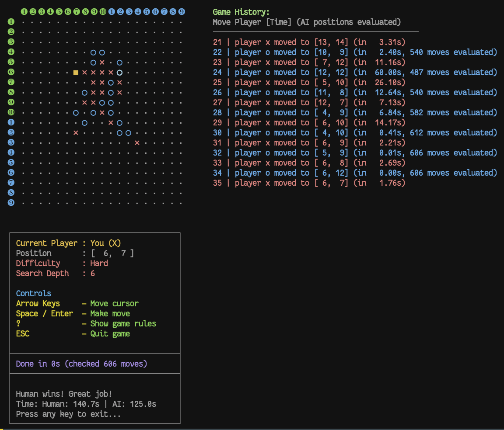

[](https://github.com/kigster/gomoku-cpp23/actions/workflows/ci.yml)

# Gomoku Game - Modern C++ Implementation 

> [!TIP]
> This is a modern [C++23 implementation](doc/CPP23.md) of the [Gomoku](https://en.wikipedia.org/wiki/Gomoku) (aka "Five-in-a-Row") game (also known as "Renju", or in the eastern countries, "Crosses and Naughts") featuring an intelligent AI opponent that leans on the MiniMax algorithm with Alpha-Beta pruning, and advanced parallel processing.  

> [!CAUTION]
> To build this project requires C++23 compatible compiler, such as gcc-11 (the earliest version supporting C++23 features), but recommended at least gcc-15. For `clang` compiler, you need Clang-16 as a likely minimum, but Clang-17 is preferred). You can use either `make` or `cmake` to build the project.

## OS Support

* This project has been developed on MacOS, and builds/compiles on both Apple M-series and Intel prrocessors.
* Linux support will be added in a short future.

## Project Structure

There are additional markdown files describing various components. Click on the approprite link to get more details, wherever the link is available.

## Build Targets

This project builds four execuable binaries:

**Core Executables:**

* `bin/gomoku` - is the [interactive ANSI Terminal game "Gomoku"](doc/GOMOKU.md) where you can play against the computer, or computer can play against itself, or human vs human. There are many CLI flags that control various features and difficulty of the game. Many more details are available in the [GOMOKU.md](doc/GOMOKU.md) file.
* `bin/gomoku-httpd` - is the [HTTP server](doc/HTTPD.md), that (by the default) listens on port 5500, and provides a multi-threaded process that is capable of responding to several endpoints, including the `/ai/v1/move` end point, which receives a board in a particular state and returns the same board with the next move placed on it. It's meant to be used by the stateful web or mobile clients.

**Test Executables**:

* `bin/test-gomoku` is the set of unit tests for the game classes, written using the GoogleTest library
* `bin/test-gomoku-httpd` is the unit tests for the `gomoku-httpd` service.

> [!NOTE]  
> This is an enhanced C++23 version based on the original C implementation at [github.com/kigster/gomoku-ansi-c](https://github.com/kigster/gomoku-ansi-c/). This version includes significant additional features including **computer vs computer gameplay**, parallel AI processing, and modern C++23 language features. This project was produced in colaboration with Claude-4-MAX, but the the original **evaluation function** was written by the author. Also, when we say "playing with AI" we do not mean LLMs, we simply mean you are playing against the computer.

## Example Game Screenshot



## Building the Game

### Using `make`

```bash
# Build the game
make build -j 4

# Clean build files if needed
make clean
```

### Using `cmake`

```bash
# Build using CMake (creates build directory and runs cmake ..)
make cmake-build

# Run tests using CMake
make cmake-test

# Clean CMake build directory
make cmake-clean

# Rebuild from scratch
make cmake-rebuild
```

## License & Copyright

This project is © Konstantin Gredeskoul, 2025. It is open source and can be distributed under the MIT License.

## Contributing

Contributions are welcome! Please feel free to submit issues, feature requests, or pull requests:

[https://github.com/kigster/gomoku-cpp23/issues](https://github.com/kigster/gomoku-cpp23/issues)

## Acknowledgments

- **Original C Implementation**: Based on [github.com/kigster/gomoku-ansi-c](https://github.com/kigster/gomoku-ansi-c/) — single threaded ANSI Terminal game.
- **Pattern Recognition**: Algorithms adapted from traditional Gomoku AI techniques
- **Google Test Framework**: For comprehensive C++ testing infrastructure
- **Modern C++23**: Leveraging latest language features for safety and performance
- **Claude-4-MAX**: AI pair programming assistant for the C++23 modernization
- **Thread Pool Design**: High-performance concurrent processing implementation (author unknown)

## Version History

- **v3.0.0**: [HTTPD.md](doc/HTTPD.md) file describing features of the `httpd` server
- **v2.0.2**: [CPP23.md](doc/CPP32.md) file describing C++23 features used and a fix to cursor directions
- **v2.0.0**: Modern C++23 implementation with parallel processing and computer vs computer gameplay
- **v1.x.x**: Original C implementation (see [github.com/kigster/gomoku-ansi-c](https://github.com/kigster/gomoku-ansi-c/))


